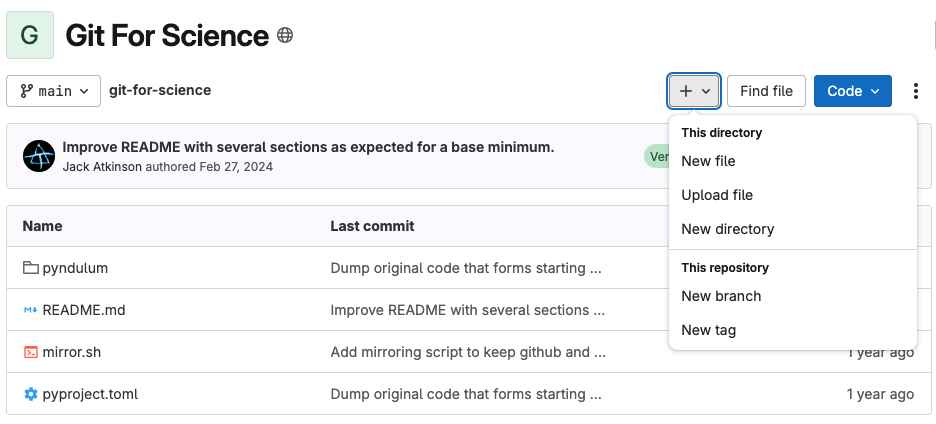
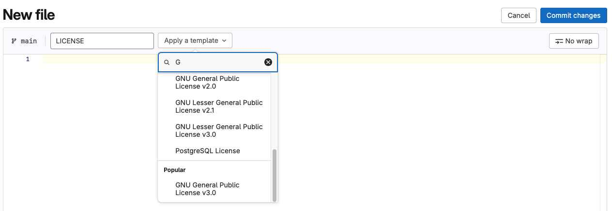
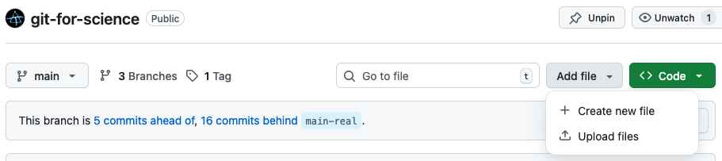
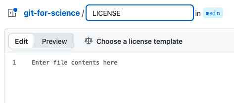
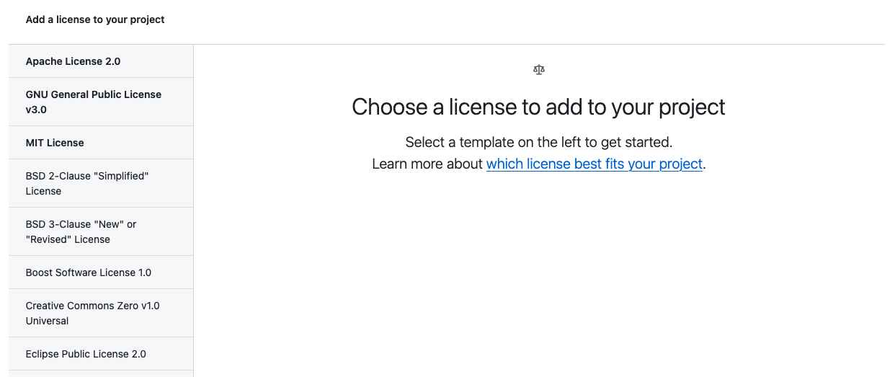

<!----------------------------------------------------------------------------------->

## Licenses {.smaller}

All public codes should have a license attached!

- As a `LICENSE` file in the main directory
  - Recommended to to choose an [OSI-approved](https://opensource.org/licenses) license
    without modification.
- Protects ownership and limits liability
- Enables collaboration
- Clarifies what can be done with the code and its derivatives
  - Public Domain &#8596; Permissive &#8596; Copyleft
  - The options may depend on your organisation and/or funder.

See [choosealicense.com](https://choosealicense.com/) and the
[OSI list of licenses](https://opensource.org/licenses) for more information.

GitHub and GitLab contain helpers to easily create popular licenses.

<!----------------------------------------------------------------------------------->

## Adding a License - GitLab {.smaller}

:::: {.columns}
::: {.column width="50%"}
**1)** From the main repo select the "+" dropdown menu and "New file".

{width=100%}
:::
::: {.column width="50%"}
**2)** In the filename type "LICENSE" and GitLab will detect and offer you a dropdown to choose
a LICENSE template.

{width=100%}
:::
::::
**3)** Once you have chosen you can "Commit Changes" to add the file.
It will appear as a LICENSE file at the top of the repository and will
be detected by GitLab in the right hand side metadata.

<!----------------------------------------------------------------------------------->

## Adding a License - GitHub {.smaller}

From the main repo select "Add file" and "+ Create new file".

{width=80%}

In the filename type "LICENSE" and GitHub will detect and offer you the option to choose
a LICENSE template.

{width=40%}

## Adding a License - GitHub {.smaller}

Select your desired license and follow the instructions to apply it to your repository.
Once complete it will appear as a LICENSE file at the top of the repository and will
be detected by GitHub in the right hand side metadata.

{height=40%}

<!----------------------------------------------------------------------------------->

## Exercise - License {.smaller}

Add a license to our _pyndulum_ code.

\

We will use the online helper features of GitHub or GitLab to choose and add a License.

\

Once you have done this don't forget to run:
```default
git pull <repo> <branch>
```
from your local copy to get these changes locally before you make further updates.

<!----------------------------------------------------------------------------------->
