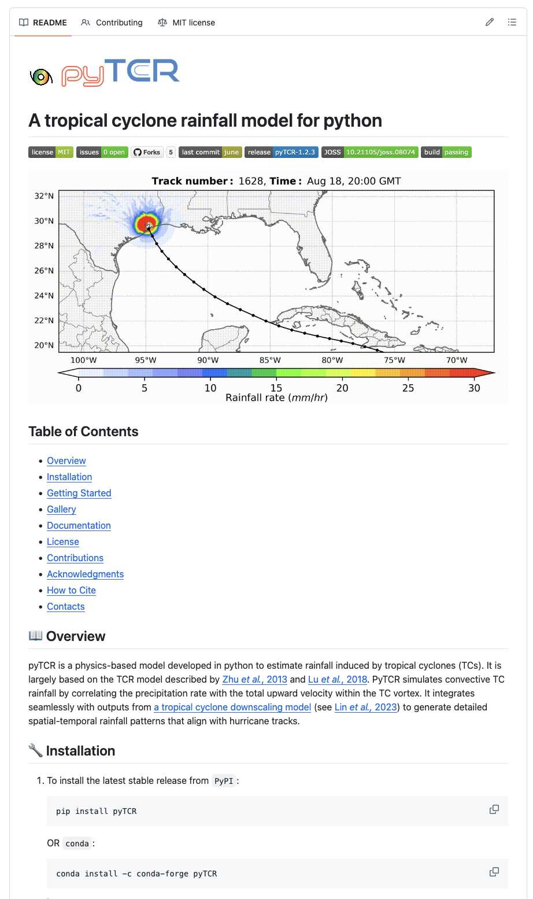
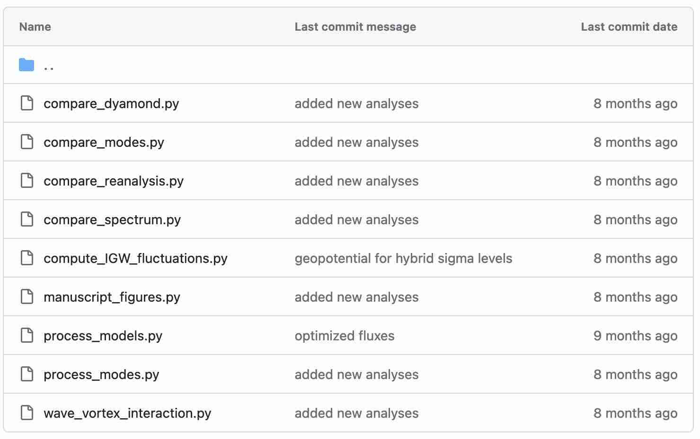
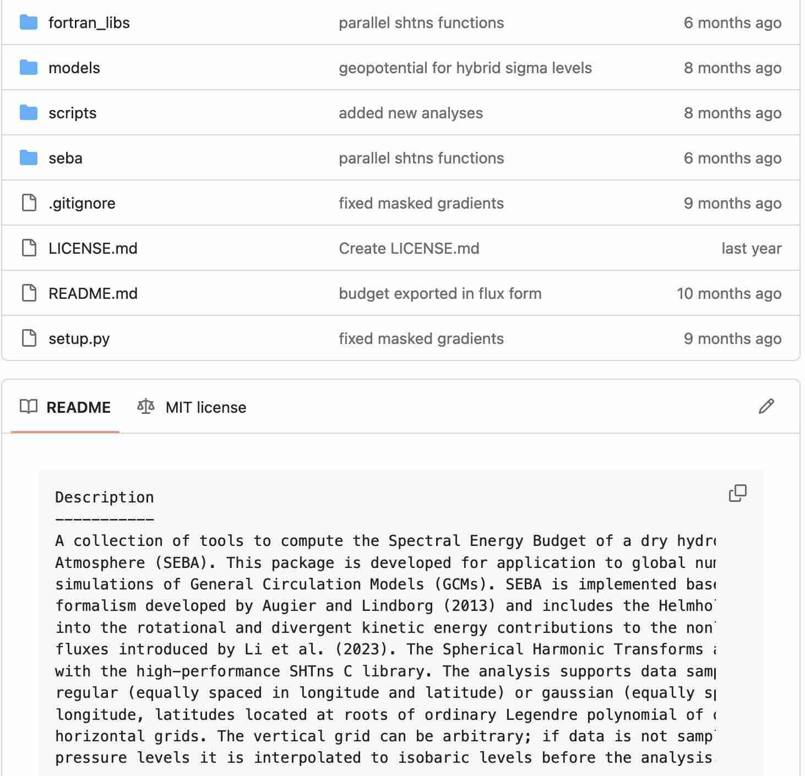
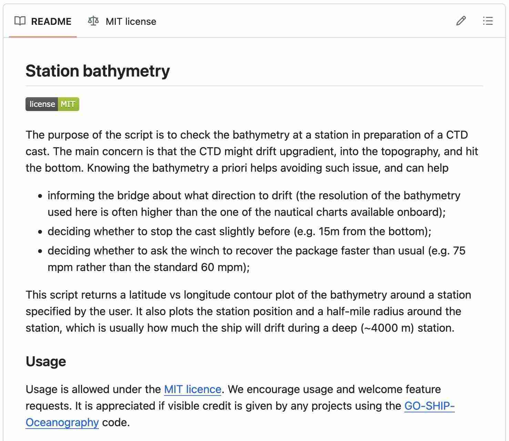
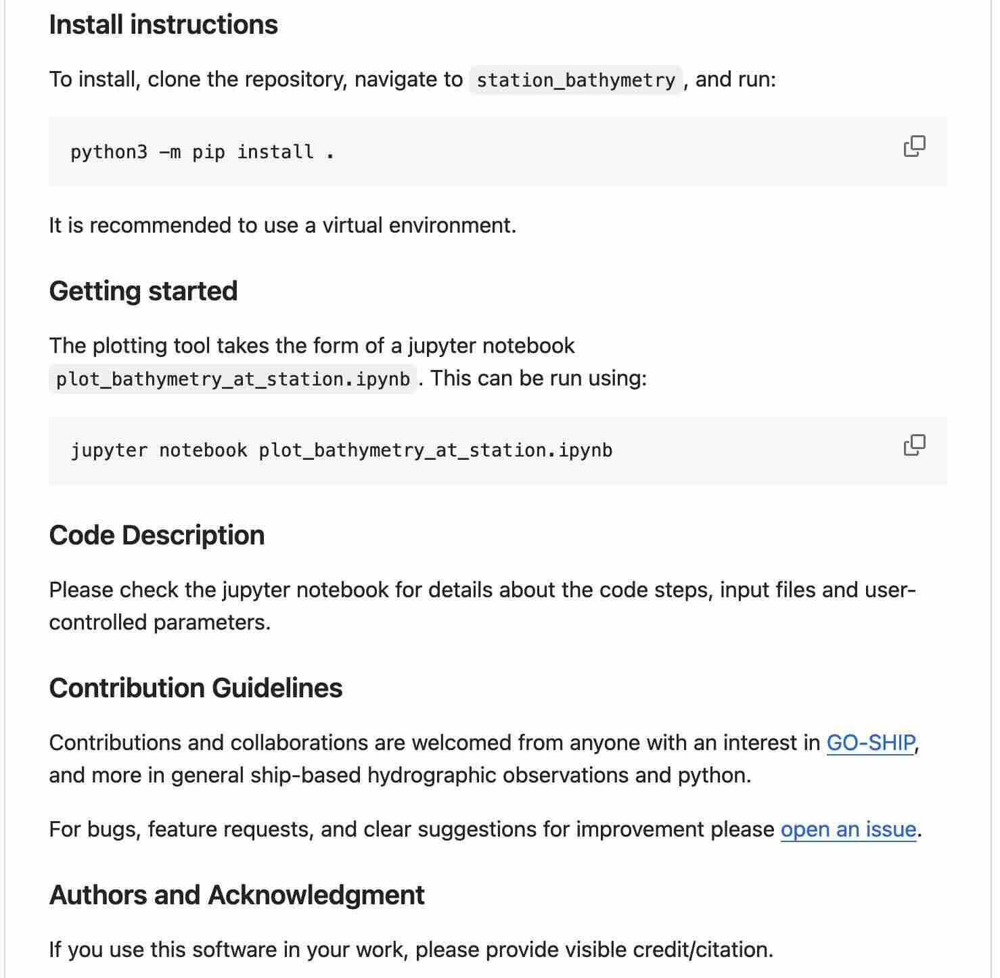
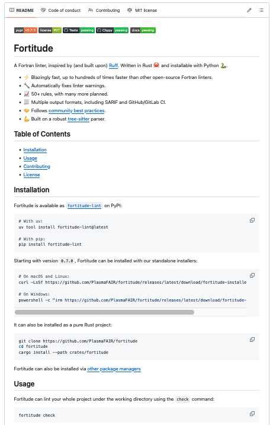

<!----------------------------------------------------------------------------------->

## README {.smaller}

:::: {.columns}
::: {.column width=50%}
- A file in the main directory of your repository.
- The entry point for new users.
- Helps to ensure your code:
  - is accessible
  - is used properly
  - has longevity
- Today encouraged to be written in [Markdown](https://www.markdownguide.org/)
  as `README.md`.
:::
::: {.column .v-center-container style="text-align: center; width: 50%;"}
{width=65%}
:::
::::

<!----------------------------------------------------------------------------------->

## README - examples {.smaller}

<!--::: {.fragment .fade-in-then-out}-->
{.absolute left=25% width=50%}
<!--:::-->

::: {.fragment .fade-in-then-out}
{.absolute left=25% width=50%}
:::
<!--
::: {.fragment}
{.absolute left=0% width=48%}
{.absolute right=0% width=48%}
:::
-->

<!----------------------------------------------------------------------------------->

## README {.smaller}

:::: {.columns}
::: {.column width=50%}
#### Essential:

- Name
- Short summary
- Install instructions
- Usage/getting-started instructions
- Information about contributing
- Authors and Acknowledgment
- License information

:::
::: {.column}
#### Nice to have:

- References to key papers/materials
- Badges
- Examples
- Link to docs
- List of users
- FAQ
- See [readme.so/](https://readme.so) for a longer list

:::
::::

[makeareadme.com](https://www.makeareadme.com/) and [readme.so](https://readme.so/)
are great tools to help.\
\
Add as soon as you can in a project and update as you go along.

<!----------------------------------------------------------------------------------->

## README - good examples {.smaller}

:::: {.columns}
::: {.column width=50%}
- [pyTCR](https://github.com/levuvietphong/pyTCR/) - Tropical cyclone rainfall modelling
- [FTorch](https://github.com/Cambridge-ICCS/FTorch) - coupling PyTorch to Fortran
- [pyrealm](https://github.com/ImperialCollegeLondon/pyrealm) - plant modelling
- [Fortitude](https://github.com/PlasmaFAIR/fortitude) - a Fortran linter
- [Station Bathymetry](https://github.com/GO-SHIP-Oceanography/station_bathymetry) -
  notebook-based repo for data analysis
- [The 'Best-README-template'](https://github.com/othneildrew/Best-README-Template)
:::
::: {.column .v-center-container style="text-align: center; width: 50%;"}
{width=65%}
:::
::::

<!----------------------------------------------------------------------------------->

## Exercise - README {.smaller}

How can we improve the README in the _pyndulum_ code?

Edit the `README.md` file to improve it.
In-particular think about:

- A description of what the code is
- How it can be installed
- How to use it or get started
- Information about the authors and how to contribute

Add and commit your changes.

If you are working from a fork then push to see these changes reflected on the online
remote repository.

<!----------------------------------------------------------------------------------->
