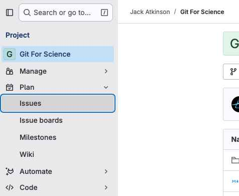

<!----------------------------------------------------------------------------------->

## Issues {.smaller}

:::: {.columns}
::: {.column width="60%"}
Both GitHub and GitLab have methods for tracking issues.

These are useful for organising work.

- managing separate tasks
- logging new issues as they arise
- tracking and scheduling development

Example issues:

- [CLUBB-ML](https://github.com/m2lines/clubb_ML/issues)
  e.g. [#13](https://github.com/m2lines/clubb_ML/issues/13) or
  [#17](https://github.com/m2lines/clubb_ML/issues/17)
- [Cambridge-ICCS/FTorch](https://github.com/Cambridge-ICCS/FTorch/issues)
- [TCTrack](https://github.com/Cambridge-ICCS/TCTrack/issues)
:::
::: {.column width="40%"}
::: {.v-center-container style="text-align: center;"}
GitHub\
{width=100%}

GitLab\
{width=75%}
:::
:::
::::

::: {.aside}
NOTE: Issues are part of GitHub/GitLab, NOT the git repository.\
They will not be kept if you move the project elsewhere and do not appear on your
local system.
:::

<!----------------------------------------------------------------------------------->

## Exercise - Issues {.smaller}

It would enhance the _pyndulum_ code if we added functions to calculate:

- pendulum total energy, and
- pendulum length from desired period.

\

We will open issues for these on the online repository.

I will open one for pendulum energy, but you should open one for pendulum length.

\

::: {style="font-size: 0.5em;"}
> **!NOTE "Issues and Forks"**
> 
> By default issues are off for forks, so you should open the issue on my copy of the
> repository on [GitLab](https://gitlab.com/jatkinson1000/git-for-science/-/issues)
> or [GitHub](https://github.com/jatkinson1000/git-for-science/issues).
:::

::: {.aside}
Extension: Beyond the scope of today's course you can also use
[GitHub Projects](https://docs.github.com/en/issues/planning-and-tracking-with-projects)
to further organise your work.
:::

<!----------------------------------------------------------------------------------->
