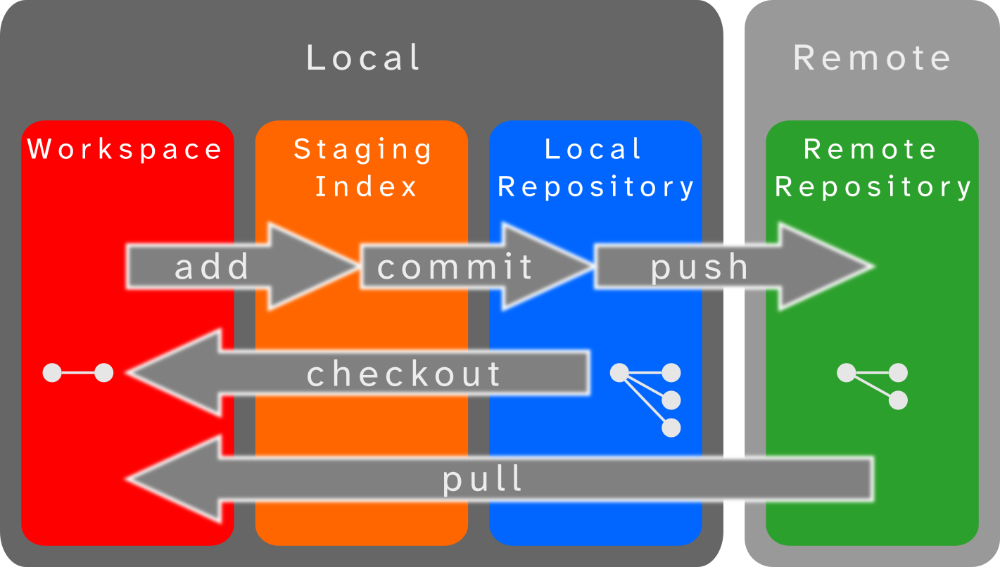
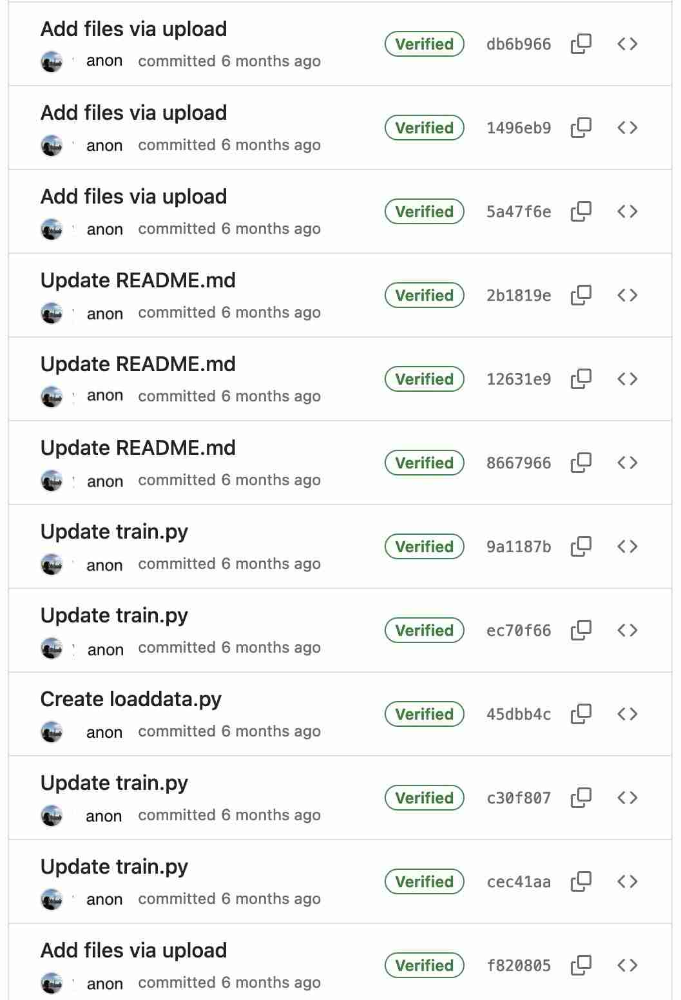
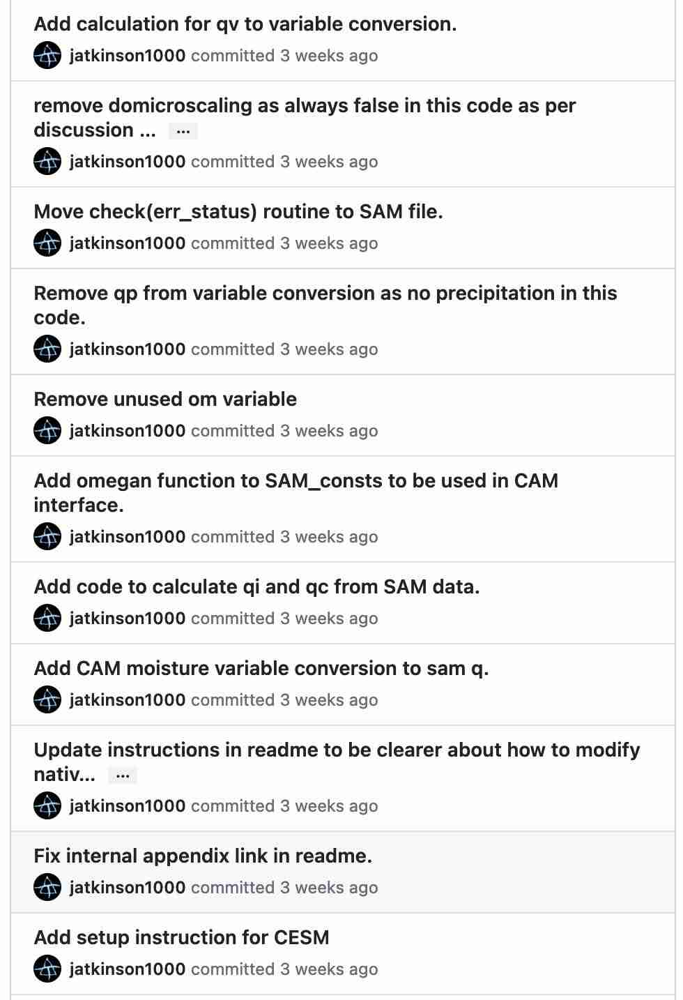

## Precursors {.smaller .nostretch}

:::: {.columns}
::: {.column width="55%"}
#### Slides and Materials

To access links or follow on your own device these slides can be found at:  
[jatkinson1000.github.io/git-for-science](https://jatkinson1000.github.io/git-for-science)

\

All materials are available at:

::: {style="font-size: 95%;"}

- [gitlab.com/jatkinson1000/git-for-science](https://gitlab.com/jatkinson1000/git-for-science)
- [github.com/jatkinson1000/git-for-science](https://github.com/jatkinson1000/git-for-science)
:::
:::
::: {.column width="45%"}
#### Licensing

Except where otherwise noted, these presentation materials are licensed under the Creative Commons
[Attribution-NonCommercial 4.0 International](https://creativecommons.org/licenses/by-nc/4.0/legalcode) ([CC BY-NC 4.0](https://creativecommons.org/licenses/by-nc/4.0/)) License.

{width=40% fig-align="center"}

Vectors and icons by [SVG Repo](https://www.svgrepo.com)
used under [CC0(1.0)](https://creativecommons.org/publicdomain/zero/1.0/deed.en)
:::
::::

## Precursors {.smaller}

:::: {.columns}
::: {.column width="70%"}
- Be nice ([Python code of conduct](https://www.python.org/psf/conduct/))
- Ask questions whenever they arise.
  - Someone else is probably wondering the same thing.
  - For troubleshooting please write a message in the zoom chat and someone will assist you in a thread
  - For more general queries please raise a hand.
- I will make mistakes.
  - Not all of them will be intentional.
:::
::::

## Learning Objectives {.smaller}

:::: {.columns}
::: {.column width="55%"}
- Recap the basic git commands
- Improve contextual understanding of git:
  - through mental models
  - review landscape

::: {.v-center-container style="text-align: center;"}
{width=75%}
:::

:::

::: {.column width="45%"}
::: {.fragment}
- Understand key components of git repositories to aid in collaboration
:::

::: {.fragment}
- Lern how to use git and GitHub/GitLab to better manage development and collaboration
  - branches
  - issues
  - merge/pull requests
  - code review
:::

:::
::::

<!-- ============================================================================== -->

## Structure & Premise {.smaller}

- This workshop has teaching interwoven with practical exercises
- We will be cloning a basic git repository and improving it over the session
- After learning new concepts we will immediately put them into practice
  with a coding exercise before returning to learn more.

I suggest you have open:

- A text editor or IDE
- A terminal window
- A browser window

<!-- ============================================================================== -->

## Structure & Premise {.smaller}

You are doing some work on pendula and your colleague says they have written some code
that solves the equations and they can share with you.\
This is made easy by the fact that it is on git!\
Let's see how we get on...

Go to the workshop repository:

- GitHub:  [github.com/jatkinson1000/git-for-science](https://github.com/jatkinson1000/git-for-science)
- GitLab: [gitlab.com/jatkinson1000/git-for-science](https://gitlab.com/jatkinson1000/git-for-science)

If you have an account then `fork` the repository and clone your fork.\

<!-- ============================================================================== -->



<!-- ============================================================================== -->

<!-- Section on README, License, and .gitignore and how to add on GitLab/Hub -->
# Repository Files





<!-- ============================================================================== -->

<!-- Section on issues, branches, pull requests, and code review -->
# Git Workflow







<!-- ============================================================================== -->

## Aside - Commit Messages {.smaller}

{.absolute left=0% width=40%}

::: {.fragment}
{.absolute left=45% width=40%}
:::

## Aside - Commit Frequency {.smaller}

:::: {.columns}
::: {.column width="50%"}
There are differing thoughts on commit frequency and style.
I suggest:

- Synoptic Scale: Project or Meta-issues
- Mesoscale: Pull requests
- Microscale: Commits
:::
::: {.column}
Some useful examples:

- [CAM-ML #23](https://github.com/m2lines/CAM-ML/pull/23) - Adding number concentration calculations
- [CAM-ML #32](https://github.com/m2lines/CAM-ML/pull/32) - restoring a previously
  removed variable\
  We can look directly at
  [8bdb319](https://github.com/m2lines/CAM-ML/pull/32/commits/8bdb319e453290845d57ccca0528f9a68f1fb6b9)
  to see what needs doing.
- [FTorch #230](https://github.com/Cambridge-ICCS/FTorch/pull/320) - Adding optimizers\
  A little long, but shows the development process and discussions.
- [TCTrack #69](https://github.com/Cambridge-ICCS/TCTrack/pull/69) - Refactoring code structure\
  A big refactor, but we break up into logical chunks should one have an issue.
:::
::::

<!-- ============================================================================== -->

# Closing

## Summary {.smaller}

git is not just a series of backups, it is a project management system.

\

:::: {.columns}
::: {.column width="50%"}
- Improve your repositories:
  - README.md
  - LICENSE
  - .gitignore

- Use branches:
  - Separate workflows
  - Organise project
:::
::: {.column width="50%"}
- Make full use of GitLab/GitHub features:
  - Helper tools
  - Issues
  - Pull Requests
  - Code review:
    - Learn, spot bugs, improve re-useability
:::
::::

## Beyond today {.smaller}

As we said at the opening, git is a rabbit hole.

- Project Boards for project management
- Merge commit, squash, and rebase options for merging
- `git rebase` - to shuffle history and keep things clean
- `git add -p` - patched commits, add a section of a file
- `git commit --fixup` - for when you missed something out of a commit
- Continuous Integration Workflows
- pre-commit

<!-- ============================================================================== -->

## Where can I learn more? {.smaller}

:::: {.columns}
::: {.column width="50%"}
- References and links in these slides
- [Pro Git book](https://git-scm.com/book/en/v2)
- If something has gone really wrong: [ohshitgit.com](https://ohshitgit.com/)
- Cambridge RSE Seminars
  - Weekly presentations in Cambridge and online
  - See [rse.group.cam.ac.uk](https://rse.group.cam.ac.uk/)
:::
::: {.column width="50%"}

- GitButler's 2024 FOSDEM talk "so you think you know git?":

<iframe width="100%" src="https://www.youtube.com/embed/aolI_Rz0ZqY?si=cTgzuRQRB65STBGD" title="YouTube video player" frameborder="0" allow="accelerometer; autoplay; clipboard-write; encrypted-media; gyroscope; picture-in-picture; web-share" allowfullscreen></iframe>
:::
::::

## Thanks

:::: {.columns}

::: {.column width="20%"}
Get in touch:
:::
::: {.column width="80%"}
 \ Jack Atkinson

 \ [jackatkinson.net](https://jackatkinson.net)

 \ [jwa34[AT]cam.ac.uk](mailto:jwa34@cam.ac.uk)

 \ [jatkinson1000](https://github.com/jatkinson1000)

 \ [\@jatkinson1000\@hachyderm.io](https://hachyderm.io/@jatkinson1000)
:::
::::

## References {.smaller}

::: {#refs}
:::

Plus other links throughout the slides.
